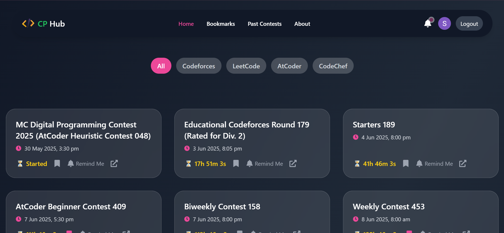
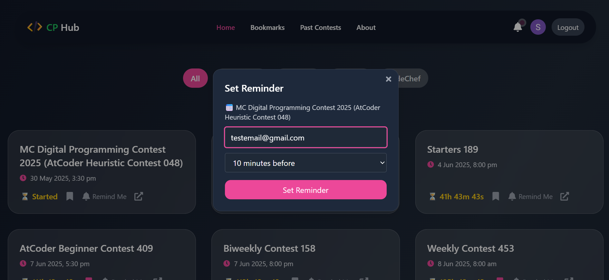
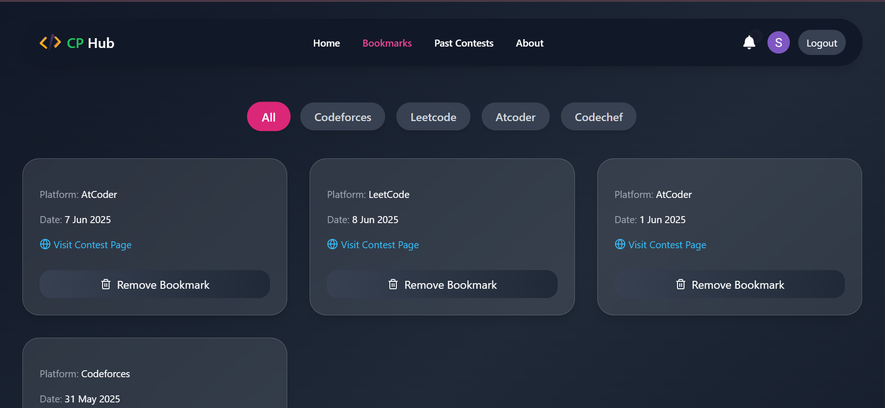

# 🧠 Competitive Programming Contest Tracker

A full-featured MERN web application that tracks upcoming and past competitive programming contests from platforms like **Codeforces, CodeChef, AtCoder and LeetCode**. It allows users to log in via **Google Authentication**, **bookmark contests**, **set email reminders**, and **filter contests by platform**. A modern UI and real-time countdown timers make this tool useful and user-friendly for regular CP enthusiasts.

---

## 🚀 Features

- 🔐 **Google Authentication** using Google OAuth via Firebase
- 📅 **Upcoming and Past Contests** from last 28 days (via Clist API)
- ⏱️ **Live countdown timer** until contest starts
- 🔍 **Filter contests** by platform (e.g., Codeforces, LeetCode)
- ⭐ **Bookmark contests**
- 📧 **Email reminders** (custom: 1 hr / 30 mins before)
- 🗣️ **Feedback system** to collect user suggestions
- 📱 Fully responsive and clean UI

---

## 🛠️ Tech Stack

| Layer      | Technology                         |
|------------|------------------------------------|
| Frontend   | React.js, Tailwind CSS             |
| Backend    | Node.js, Express.js                |
| Database   | MongoDB Atlas                      |
| Auth       | Google OAuth via Firebase          |
| API Used   | [Clist.by API](https://clist.by)   |
| Mail       | NodeMailer                         |
| Scheduler  | node-cron                          |

---

## 📸 Screenshots

> Add your screenshots inside `/screenshots` folder and update these links 👇

| Home Page | Filter & Bookmarks | Reminder Setup |
|-----------|--------------------|----------------|
|  |  |  |

---

## 🧰 Getting Started

### 1. Clone the repo

```bash
git clone https://github.com/YOUR_USERNAME/Contest-Tracker.git
cd Contest-Tracker
```

### 2. Install dependencies

```bash
npm install
cd my-app
npm install
```

### 3. Environment variables

Create `.env` in `/backend` folder.

Your env file should like this  a `.env.example` like:

```
MONGO_URI=your_mongodb_uri
API_KEY=your_clist_key
EMAIL_USER=your_email
EMAIL_PASS=your_email_password

```

Add real values in `.env` .

### 4. Start the app

```bash
# Start backend
node server.js

# Start frontend
cd my-app
npm run dev
```

---


## 📬 Feedback

Feel free to submit issues or feature requests.

---

## 👨‍💻 Author

**Sanjeet Kumar Patel**  
[GitHub](https://github.com/Sanjeet63) | [LinkedIn](https://linkedin.com/in/sanjeet-patel-08785725a/)

---

## ⭐ Support

If you like the project, consider giving it a ⭐ on GitHub!
